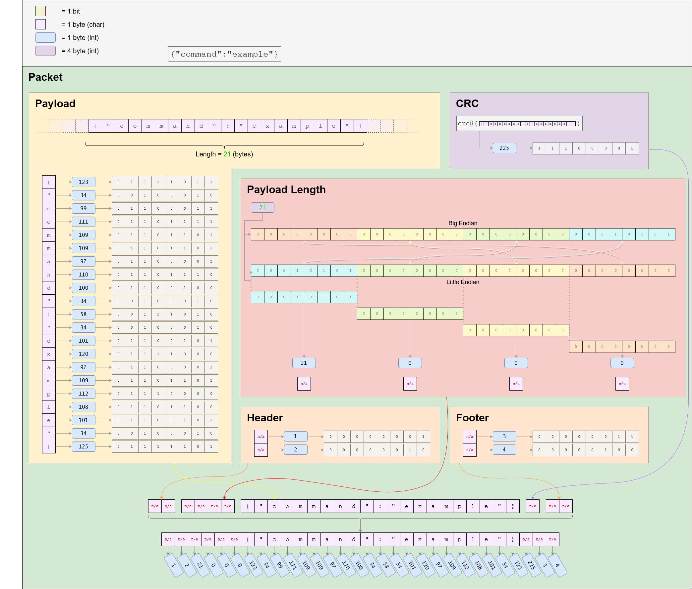

# Description

This python app exists to help our integrators understand how Redwave's API works. You may not be developing your integration in python but, since python is fairly common, this app can help you become familiar with how to establish a connection and send/receive commands from our device. Currently, the API exists on our InterceptIR and XplorIR devices.

## On Windows using Powershell

If you're downloading the project for the first time...

```
PS> git clone https://github.com/redwavetech/redwave-device-api-test-app.git
PS> cd redwave-device-api-test-app
```
If you've already cloned the project...
```
PS> cd redwave-device-api-test-app
PS> git pull origin master
```
Now create your virtual environment with...
```
PS> python -m venv venv
PS> .\venv\Scripts\activate
PS> python -m pip install -r requirements.txt
```
> If you run into an error like `Active.psql cannot be loaded because running scripts is disabled on this system` when trying to load your venv, you can try running your PowerShell as administrator and then run `Set-ExecutionPolicy AllSigned`.

<br />

At this point, the python app is ready to run.  Before you make a request from the python app to the device, please follow these steps:

- Connect the USB cable to your PC but not to the device (yet)
- run `python ports.py` at the command prompt to determine which port your device is connected to
- Turn on Redwave's InterceptIR device and wait for the green light to come on
- Connect the other end of the USB cable to the InterceptIR (this must be done within a couple seconds of when the green light comes on)
- When the port name appears, press `ctrl c` to exit
- Turn off the device


Now that you know the port, change the the PORT_NAME variable in the python script with the following steps:

- open `request-response.py`, find this line `PORT_NAME = 'COMxx'` near the top of the file, and change the `PORT_NAME` value to the port your device is connected to

Now that the `PORT_NAME` is updated, it's time to connect to the API with the following steps:

- Connect the USB cable to your PC but not to the device (yet)
- run `python request-response.py` at the command line
- Turn on Redwave's InterceptIR device and wait for the green light to come on
- Connect the other end of the USB cable to the InterceptIR (this must be done within a couple seconds of when the green light comes on)
- You should be ready to send commands to the device within 60 seconds

## On Mac

```
$ git clone https://github.com/redwavetech/redwave-device-api-test-app.git
$ cd redwave-device-api-test-app
```
If you've already cloned the project...
```
$ cd redwave-device-api-test-app
$ git pull origin master
```
Now create your virtual environment with...
```
$ python -m venv venv
$ source venv/bin/activate
$ python -m pip install -r requirements-mac.txt
```

If you're on a Mac, you have the ability to send command requests in one terminal while listening to responses in the other. To do this...

- Connect the USB cable to your Mac but not to the device (yet)
- Open a terminal window and run `python response.py`
- Turn on Redwave's InterceptIR device and wait for the green light to come on
- Connect the other end of the USB cable to the InterceptIR (this must be done within a couple seconds of when the green light comes on)
- Within ~60 seconds, the device should be ready to receive commands with the following steps:
- Open another terminal
- Run `python -m venv venv`
- Run `source venv/bin/activate`
- Run `python request.py --command='{"command": "get_device_info"}'`. The response should appear in the other terminal

To test other commands, replace the `--command=` argument with your desired command. All the available commands are listed below.

When you're done, you can exit from your virtual environment with the following command: `deactivate`

<br />

# Message Format

The format of the message following the following format: 

```
  * In-Memory View
  * +-----+-----+----------+-----------------------+-----+-----+-----+
  * | SOH | STX |   pLen   |        Payload        | CRC | ETX | EOT |
  * +-----+-----+----------+-----------------------+-----+-----+-----+
  * 0     1     2          6                      N-3   N-2   N-1    N	(Bytes)
```

Here is detailed information on each packet:

```
 *    ___________________________________________________________
 *    - SOH                                                      \
 *        Start of Heading ASCII control character 0x01.          \
 *                                                                 \____ Header
 *    - STX                                                        /     2 Bytes
 *        Start of Text ASCII control character 0x02.             /
 *    ___________________________________________________________/
 *    - pLen                                                     \
 *        Unsigned integer (little endian) representing the       \
 *        length of Payload. This should always end up being       \____ Payload length
 *        n-9 bytes with respect to this structure. Doubles        /     4 Bytes
 *        as an additional packet validity check.                 /
 *    ___________________________________________________________/
 *    - Payload                                                  \
 *        Serialized JSON data. This is the user data to be       \
 *        extracted if and only if:                                \
 *            1. Header exists at the beginning of the packet       \___ Payload (user data)
 *            2. pLen matches the length of the payload             /    N-9 Bytes
 *            3. CRC matches the receiving ends crc calculation    /
 *            4. Footer exists at the end of the packet           /
 *    ___________________________________________________________/
 *    - CRC                                                      \
 *        8-bit cyclic redundancy check on Payload. This greatly  \_____ Cyclic Redundancy Check
 *        mitigates the chances of processing invalid user data   /      1 Bytes
 *    ___________________________________________________________/
 *    - ETX                                                      \
 *        End of Text ASCII control character 0x03.               \
 *                                                                 \____ Footer
 *    - EOT                                                        /     2 Bytes
 *        End of Transmission ASCII control character 0x04.       /
 *    ___________________________________________________________/
```

Failure to correctly format your message in the above format will results in an `Invalid packet format` error being returned.  Here is a visual representation of the message format:



<br />

# API Description

_NOTE: The API will be part of Redwave's XplorIR and InterceptIR devices._

The following commands are available in a request/response fashion. Our Team Leader app or your own proprietary app will send a JSON command to Redwave's device and the device's API will return a JSON response. 

## List of Commands

<table>
    <tr>
        <th>Command</th>
        <th>Availability</th>
    </tr>
    <tr>
        <td><a href="#get_device_info">get_device_info</a></td>
        <td>Currently available</td>
    </tr>
    <tr>
        <td><a href="#start_cm">start_cm</a></td>
        <td>Currently available</td>
    </tr>    
    <tr>
        <td><a href="#cancel_cm">cancel_cm</a></td>
        <td>Currently available</td>
    </tr>     
    <tr>
        <td><a href="#disconnect">disconnect</a></td>
        <td>Currently available</td>
    </tr>                     
    <tr>
        <td><a href="#start_background_collection">start_background_collection</a></td>
        <td>Next release</td>
    </tr> 
    <tr>
        <td><a href="#start_sample_collection">start_sample_collection</a></td>
        <td>Next release</td>
    </tr>  
    <tr>
        <td><a href="#cancel_spd">cancel_spd</a></td>
        <td>Next release</td>
    </tr>
    <tr>
        <td><a href="#get_sessions">get_sessions</a></td>
        <td>Available</td>
    </tr>
    <tr>
        <td><a href="#get_session">get_session</a></td>
        <td>Next release</td>
    </tr>  
    <tr>
        <td><a href="#get_sample">get_sample</a></td>
        <td>Next release</td>    
    </tr>       
    <tr>
        <td><a href="#run_validation_background">run_validation_background</a></td>
        <td>Next release</td>
    </tr>                              
    <tr>
        <td><a href="#run_validation_sample">run_validation_sample</a></td>
        <td>Next release</td>
    </tr> 
    <tr>
        <td><a href="#run_advanced_validation">run_advanced_validation</a></td>
        <td>Next release</td>
    </tr>                                      
    <tr>
        <td><a href="#get_diagnostics">get_diagnostics</a></td>
        <td>Next release</td>
    </tr>                              
    <tr>
        <td><a href="#get_validations">get_validations</a></td>
        <td>Next release</td>
    </tr> 
    <tr>
        <td><a href="#get_validation">get_validation</a></td>
        <td>Next release</td>
    </tr>                                                    
</table>

## Command Details

### <span id="get_device_info">_get_device_info_</span>

The following endpoint will retrieve information about the device.

```json
{
    "command":"get_device_info"
}
```

The response from this command is as follows:

```json
{
  "responseTo": "get_device_info",
  "data": {
    "serialNumber": "X0101234A",
    "instrumentId": "123456789",
    "softwareVersion": "r1.00"
  },
  "date": "2023-01-31T20:47:43.224256",
  "message": "Successfully retrieved device info",
  "status": "done"
}
```

### <span id="start_cm">_start_cm_</span>
<br />

> ### About Continuous Monitoring states
>
> When the device is in continuous monitoring mode, the device can be in any of the following states:
>
> - busy
> - monitoring
> - detection
> - identification
> - saturation
>
> Each state is explained more below. 

<br />

The following command will start a continuous monitoring session. Once a continuous monitoring session has been started, the device will send messages approximately every 5 seconds.  The type of response depends on the state the device is in. Here is the request command:

Request:

```json
{
    "command":"start_cm"
}
```

Response:

After sending the initial request, the device will be busy for up to 10 minutes while it builds it's models. During this time, the device will send the following response every 4 seconds:

```json
{  
  "date": "2023-01-31T20:47:43.224256",
  "message": "The device is busy",
  "responseTo": "start_cm",
  "status": "busy"
}
```

Once the device is done building it's models, it will go into a monitoring state. It will stay in this state until it detects a gas. The response from the device during this state will be:

```json
{  
  "date": "2023-01-31T20:47:43.224256",
  "message": "The device is monitoring. ",
  "responseTo": "start_cm",
  "status": "monitoring"
}
```

When the device detects a gas, it will be in the detection state while it runs our algorithms to find a match. During this state the device will respond with the following:

```json
{  
  "date": "2023-01-31T20:47:43.224256",
  "message": "A detection event occurred.",
  "responseTo": "start_cm",
  "status": "detection"
}
```

Shortly after that and if the detection state is able to identify a chemical, it goes into an identification state. During this state, the device will send seven messages while it runs it's algorithm to improve it's results. If you plan on storing results in your application, this would be the time to do so. The last "identification" message is the one you want to store. The response during this state is as follows:

```json
{
  "data": {
    "compounds": [
      {
        "casNumber": "67-64-1",
        "confidence": 3,
        "ghs": [],
        "idlh": "2",
        "ipcf": "",
        "isTopHit": true,
        "lel": "4",
        "name": "Isopropyl Alchohol",
        "score": 0.987
      }
    ],
    "date": "",
    "instrumentId": "016ebaee1d000019",
    "locationLat": null,
    "locationLon": null,
    "mixtureAnalysis": [],
    "name": "",
    "serialNumber": "X00030423A",
    "type": "gas"
  },
  "responseTo": "start_cm",
  "date": "2023-01-31T20:47:43.224256",
  "message": "A chemical has been identified",
  "status": "identification"
}
```

After the device has identified a chemical and the device is still in the gas plume, it goes back into the monitoring state but will continue to include the "data" node in the payload. Once the device exits the plume, it will go back to a monitoring state with no "data" node.  These responses will be as follows:

While still in the plume....

```json
{
  "data": {
    "compounds": [
      {
        "casNumber": "67-64-1",
        "confidence": 3,
        "ghs": [],
        "idlh": "2",
        "ipcf": "",
        "isTopHit": true,
        "lel": "4",
        "name": "Isopropyl Alchohol",
        "score": 0.987
      }
    ],
    "date": "",
    "instrumentId": "016ebaee1d000019",
    "locationLat": null,
    "locationLon": null,
    "mixtureAnalysis": [],
    "name": "",
    "serialNumber": "X00030423A",
    "type": "gas"
  },
  "responseTo": "start_cm",
  "date": "2023-01-31T20:47:43.224256",
  "message": "A chemical has been identified",
  "status": "monitoring"
}
```

After exiting the plume...

```json
{  
  "date": "2023-01-31T20:47:43.224256",
  "message": "The device is monitoring. ",
  "responseTo": "start_cm",
  "status": "monitoring"
}
```

Lastly, if the device pumps in too much gas it could go into a saturation state. This state can happen directly after the ready or detection states. The response for this state is as follows:

```json
{  
  "date": "2023-01-31T20:47:43.224256",
  "message": "The device is monitoring. ",
  "responseTo": "start_cm",
  "status": "saturation"
}
```

### <span id="cancel_cm">_cancel_cm_</span>

This command will stop (cancel) a continuous monitoring session.

Request:

```json
{
    "command":"cancel_cm"
}
```

Response:

```json
{
  "responseTo": "cancel_cm",
  "date": "2023-01-31T20:47:43.224256",
  "message": "Cancelled continuous monitoring.",
  "status": "done"
}
```

### <span id="disconnect">disconnect</span>

This command will disconnect the API.

Request:

```json
{
    "command":"disconnect"
}
```

Response:

```json
{
  "response": "Connection successfully terminated."
}
```

### <span id="start_background_collection">_start_background_collection_</span>

A single point detection session is a two step process. The `start_background_collection` command is the first command you need to run and will take several minutes to complete. 

```json
{
    "command":"start_background_collection"
}
```

The initial response from this command is as follows:

```json
{
  "responseTo": "start_background_collection",
  "date": "2023-01-31T20:47:43.224256",
  "message": "Successfully started background collection",
  "status": "busy"
}
```

As the background collection continues, the device will continue to send updates such as the following:

```json
{
  "responseTo": "start_background_collection",
  "date": "2023-01-31T20:47:43.224256",
  "message": "Background collection is 35% complete",
  "status": "busy"
}
```

At the end of this step, the device will respond with the following:

```json
{
  "responseTo": "start_background_collection",
  "date": "2023-01-31T20:47:43.224256",
  "message": "Successfully completed background collection",
  "status": "done"
}
```

Once you receive this response, you can send the `start_sample_collection` command.

### <span id="start_sample_collection">_start_sample_collection_</span>

The following command will start a single point sample collection. This command can only be called after the `start_background_collection` command has been run in its entirety.

```json
{
    "command":"start_sample_collection"
}
```

As the sample collection continues, the device will continually to send messages like the following:

```json
{
  "responseTo": "start_sample_collection",
  "date": "2023-01-31T20:47:43.224256",
  "message": "Sample collection is 20% complete",
  "status": "busy"
}
```

Once complete, you'll receive the following response:

```json
{
  "responseTo": "start_sample_collection",
  "date": "2023-01-31T20:47:43.224256",
  "message": "Successfully completed sample collection",
  "status": "done"
}
```

### <span id="cancel_spd">_cancel_spd_</span>

The following command will cancel a single point detection session.

```json
{
    "command":"cancel_spd"
}
```

The response from this command is as follows:

```json
{
  "responseTo": "cancel_spd",
  "date": "2023-01-31T20:47:43.224256",
  "message": "Cancelled background collection",
  "status": "done"
}
```

### <span id="get_sessions">_get_sessions_</span>

The following command will return a list of sessions on the device.

```json
 {
    "command": "get_sessions"
}
```

The response from this command is as follows:

```json
{
  "data": {
    "sessions": {
      "date" : "2023-11-09T19:02:02.00000Z",
				"name" : "2023-11-09/C-19-02-02",
				"sampleCount" : 1,
				"samples" :
				[
					{
						"date" : "2023-11-09T19:10:31.00000Z",
						"hits" :
						[
							{
								"casNumber" : "7664-41-7",
								"name" : "Ammonia",
								"score" : 0.97
							}
						],
						"locationLat" : null,
						"locationLon" : null,
						"name" : "2023-11-09/C-19-02-02/19-10-31"
					}
				],
				"type" : "cm"
    }
  },
  "date" : "2023-11-09T20:45:13.00000Z",
	"message" : "Successfully retrieved sessions",
	"responseTo" : "get_sessions",
	"serialNumber" : "X00060923A",
	"status" : "done"
}
```
### <span id="get_session">_get_session_</span>

The following command will return a list of sessions on the device.  The "name" argument is the name of the sessions which you can get by running the _get_sessions_ command (see example above)

```json
{
    "command": "get_session",
    "args": {
      "name": "2023-11-09/C-19-02-02"
    }
}
```

The response from this command is as follows:

```json
{
  "data": {
    "samples": [
      {
        "date": "2023-08-04T16:51:11.00000Z",
        "hits": [
          {
            "casNumber": "67-63-0", 
            "name": "2-propanol", 
            "score": 0.999
          }
        ],
        "locationLat": null,
        "locationLon": null,
        "name": "2023-08-04/16-51-11"
      }
    ],
    "type": "spd"
  },
  "date": "2023-08-04T17:00:11.00000Z",
  "message": "Successfully retrieved session",
  "responseTo": "get_session",
  "status": "done"
}
```

### <span id="get_sample">_get_sample_</span>

Information coming soon.

### <span id="run_validation_background">run_validation_background</span>

Information coming soon.

### <span id="run_validation_sample">run_validation_sample</span>

Information coming soon.

### <span id="run_advanced_validation">_run_advanced_validation_</span>

Information coming soon.

### <span id="get_diagnostics">get_diagnostics</span>

Information coming soon.

### <span id="get_validations">get_validations</span>

Information coming soon.

### <span id="get_validation">_get_validation_</span>

Information coming soon.


